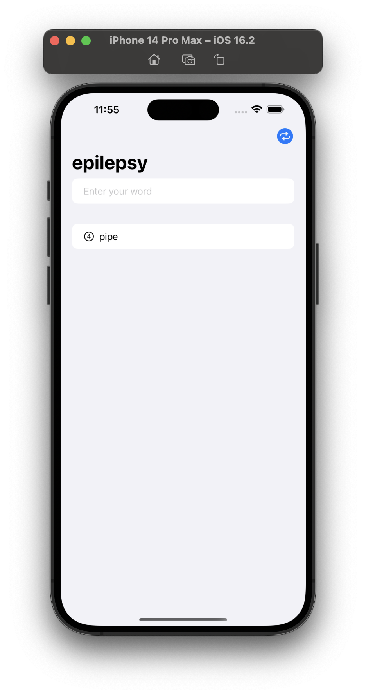
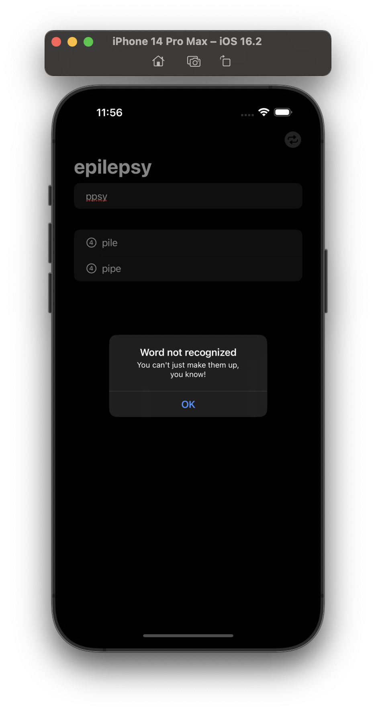
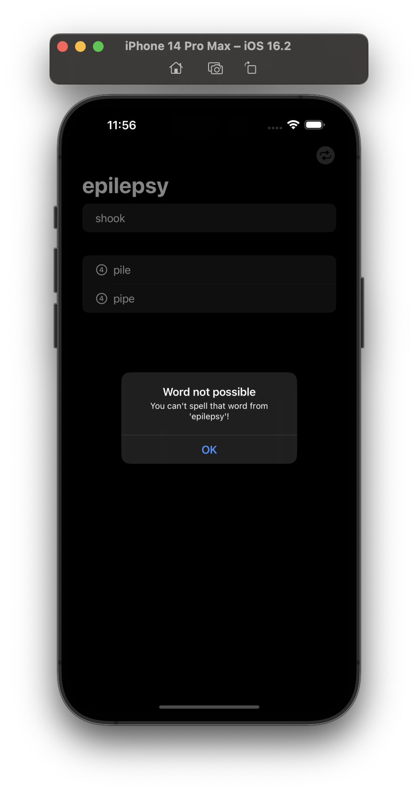
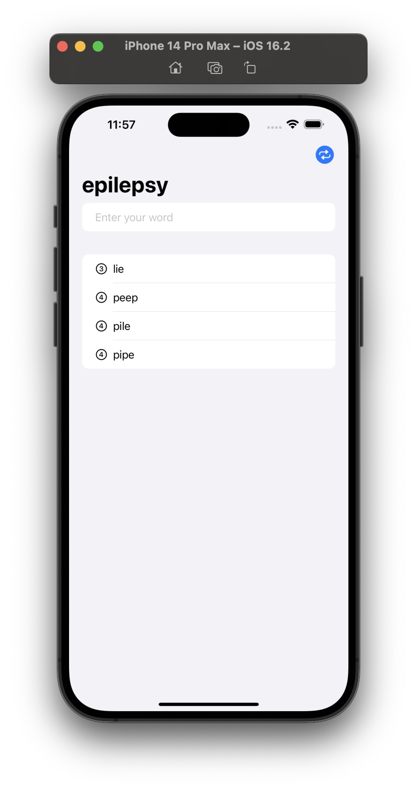

# Word Scramble

The game will show players a random eight-letter word, and ask them to make words out of it. For example, if the starter word is “alarming” they might spell “alarm”, “ring”, “main”, and so on.

## Screenshots

